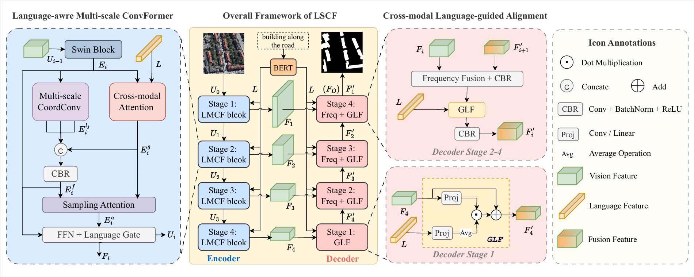

# LSCF
The code of paper "LSCF: Long-term Senmantic-guidance ConvFormer for Referring Image Segmentation".

## [LSCF: Long-Term Semantic-Guidance ConvFormer for Referring Remote Sensing Image Segmentation](https://ieeexplore.ieee.org/document/11029253)
Referring remote sensing image segmentation (RRSIS) task aims to generate segmentation masks for target objects based on language descriptions. It requires precise localization while distinguishing between visually similar yet semantically distinct objects. Fusing vision-language features only during extraction causes information loss and semantic forgetting in the decoder, harming similar target distinction. In addition, high-resolution remote sensing images present challenges, including complex backgrounds, diverse object scales, and intricate boundaries, limiting the effectiveness of previous methods. To address these issues, we propose the long-term semantic-guidance ConvFormer (LSCF) Network. First, we fuse multireceptive-field local features extracted by the multiscale coordconv (MCC) module with language-aware global features from the cross-modal attention (CA) module to obtain multimodal representations. Second, the sampling attention (SA) module enables fine-grained vision context alignment under semantic guidance. Finally, the global language fusion (GLF) module is incorporated in the decoder to maintain long-term vision-language alignment and mitigate semantic degradation. Experimental validation on the RefSegRS, RRSIS-D, and RISBench datasets demonstrates that LSCF achieves overall intersection of union (oIoU) scores of 83.27%, 77.42%, and 74.88%, and mean intersection over union (mIoU) scores of 77.44%, 64.25%, and 68.53%, respectively. On RefSegRS, LSCF surpasses the SOTA method FIANet by 5.53% (oIoU) and 9.58% (mIoU), while delivering competitive performance on RRSIS-D and RISBench.


## 🌟🌟🌟
Our group build a unified deep learning framework, RSFM, dedicated to achieving remote sensing perception, generation, and interpretation in one library. RSFM splits and regularizes various scientific tasks into an intuitive and streamlined structure, aiming to provide researchers with a readable, easily editable, and beginner-friendly codebase. Within RSFM, researchers can freely mix and match model components from different tasks to explore their full potential. Although RSFM focuses on remote sensing data, it is not limited to this domain; it also seamlessly supports natural, medical, synthetic, and industrial data as well.
- Code: https://github.com/IPIU-XDU/RSFM
- Contributors: [Xiaoqiang Lu](https://github.com/xiaoqiang-lu), [Qin Ma](https://github.com/chunbai1), [Jiamin Cao](https://github.com/JMcarrot), [Jing Zhang](https://github.com/Jerry-jing), [Xinyu Liu](https://github.com/xxxxyliu), [Chenyue Che](https://github.com/chenyueche), [Yanyan Zu](https://github.com/Zuyanyan), [Yanzhao Zhang](https://github.com/stuzyz), [Jinming Chai](https://github.com/JMcarrot), [Long Sun](https://github.com/JMcarrot)
- Copyright (c) IPIU-XDU. All rights reserved.

## Installation
```shell 
conda create -n lscf python=3.10 -y
conda activate lscf
pip config set global.index-url https://pypi.tuna.tsinghua.edu.cn/simple
pip install torch==1.13.1+cu116 torchvision==0.14.1+cu116 torchaudio==0.13.1 --extra-index-url https://download.pytorch.org/whl/cu116
pip install -r requirements.txt
mim install mmcv-full==1.7.0
pip install scikit-image transformers pycocotools
pip install tokenizers h5py

# other
apt install libgl1-mesa-glx
```


## Datasets
Please download the datasets from their official sources and organize them into the following directory structure:

```text
RSFM_RIS_Datasets
├── RISBench
│   ├── images
│   ├── masks
│   └── phrase_txts
├── RRSIS-D
│   ├── images
│   ├── masks
│   └── phrase_txts
└── RefSegRS
    ├── images
    ├── masks
    └── phrase_txts
        ├── output_phrase_test.txt
        ├── output_phrase_train.txt
        └── output_phrase_val.txt
```

### Text file format (train/val/test)

Each line in `*_train.txt`, `*_val.txt`, and `*_test.txt` should follow:

```text
<image_id> <text>
```

Example:

```text
4213 van driving on the road
945 impervious surface
3080 vehicle
2339 building along the road
```

### Download links

* RISBench: (placeholder) [https://github.com/](https://github.com/)<YOUR_ORG>/<YOUR_REPO>/releases/tag/datasets
* RRSIS-D: (placeholder) [https://github.com/](https://github.com/)<YOUR_ORG>/<YOUR_REPO>/releases/tag/datasets
* RefSegRS: (placeholder) [https://github.com/](https://github.com/)<YOUR_ORG>/<YOUR_REPO>/releases/tag/datasets


## Weights

### Training (Pretrained Backbones)

Download the pretrained weights and place them as follows.

**BERT (bert-base-uncased)**: Source: [https://huggingface.co/google-bert/bert-base-uncased/tree/main](https://huggingface.co/google-bert/bert-base-uncased/tree/main)

**Swin Transformer**: Source: [https://github.com/SwinTransformer/storage/releases/download/v1.0.0/swin_base_patch4_window12_384_22k.pth](https://github.com/SwinTransformer/storage/releases/download/v1.0.0/swin_base_patch4_window12_384_22k.pth)

Directory structure:

```text
pretrained_weights/
├── bert
│   └── bert-base-uncased
│       ├── config.json
│       ├── pytorch_model.bin
│       ├── tokenizer.json
│       ├── tokenizer_config.json
│       └── vocab.txt
└── swin_base_patch4_window12_384_22k.pth
```

### Evaluation (Checkpoints)

We also provide evaluation-ready checkpoints that reproduce the reported results:

| Dataset  | PR@5 | PR@7 | PR@9 | oIoU | mIoU | Checkpoint                                                                                              |
| -------- | ---- | ---- | ---- | ---- | ---- | ------------------------------------------------------------------------------------------------------- |
| RISBench | -    | -    | -    | -    | -    | (placeholder) [https://github.com/](https://github.com/)<YOUR_ORG>/<YOUR_REPO>/releases/tag/checkpoints |
| RRSIS-D  | -    | -    | -    | -    | -    | (placeholder) [https://github.com/](https://github.com/)<YOUR_ORG>/<YOUR_REPO>/releases/tag/checkpoints |
| RefSegRS | -    | -    | -    | -    | -    | (placeholder) [https://github.com/](https://github.com/)<YOUR_ORG>/<YOUR_REPO>/releases/tag/checkpoints |


## Usage
### Training
```shell
bash scripts/train_dist.sh <num gpus> <port>
# for example: bash scripts/train_dist.sh 2 23333
```

### Validation
```shell
bash scripts/eval_dist.sh <num gpus> <port> --weight-path <path/to/your/trained/weight>
# for example: bash scripts/eval_dist.sh 1 23333 -weight-path exps/RefSegRS/LSCF-20260115_063351/RefSegRS.swin_base.None.FreqLAVTHead.2xb4.img512.ep50.preswin_base_patch4_window12_384_22k.best91.15.pth
```

### Prediction
```shell
bash scripts/eval_dist.sh <num gpus> <port> --task predict --weight-path <path/to/your/trained/weight> --save-path <path/to/dir/you/want/save>

# for example: bash scripts/eval_dist.sh 1 23333 --task predict -weight-path exps/RefSegRS/LSCF-20260115_063351/RefSegRS.swin_base.None.FreqLAVTHead.2xb4.img512.ep50.preswin_base_patch4_window12_384_22k.best91.15.pth --save-path predict_result/RefSegRS/
```
